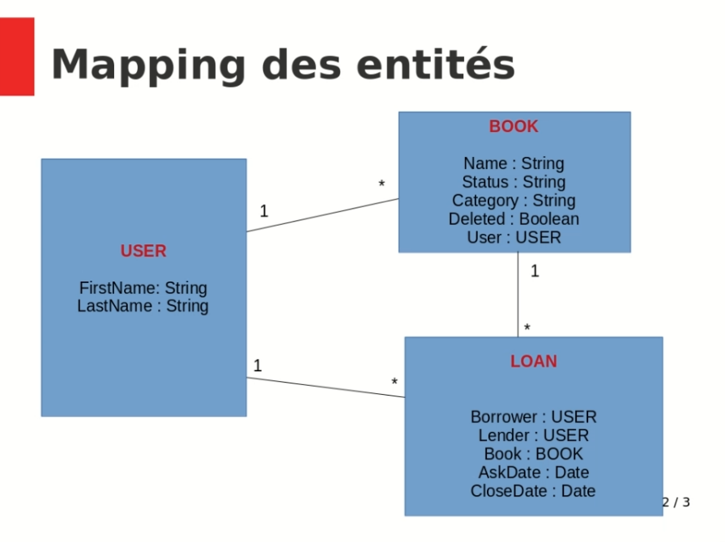

# Mapping des entités

[Spring Data JPA](https://docs.spring.io/spring-data/jpa/docs/current/reference/html/#reference)

chaque table du modèle de données correspondra à une entité JPA de Spring DATA

## Mapping des entités

 

## Repository - interrogation de la BDD

- abstraction pour interroger la BDD (possibilité de changer de système de BDD - implémentation)
- Interface qui étend une interface de SPRING (CrudRepository)
- définitions des méthodes personnalisées qui vont générer les requêtes (SQL ou non)

## ajout des dépendances Spring data jpa et h2 dans eclipse

clic droit projet/Spring/edit starters

dans avalaible : saisir JPA
-> cocher Spring Data JPA

dans avalaible : saisir H2
-> cocher Spring H2 database
